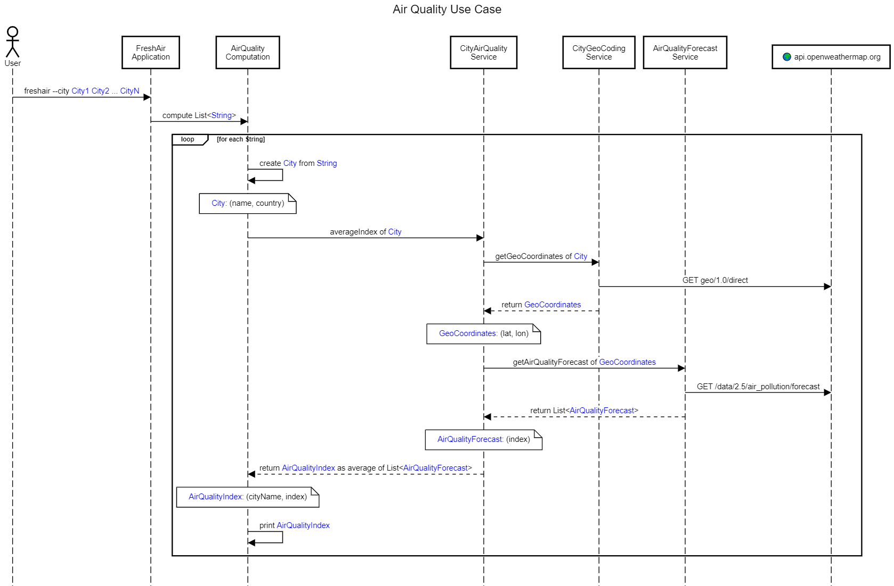

# 🦄 Wonderful FreshAir Application

Sample to play with [Kotlin](https://kotlinlang.org/) & [Arrow](https://arrow-kt.io/)

## Run

Get your OpenWeatherMap API key from [https://openweathermap.org/api]()

* Linux/MacOS
```bash
export OWM_APIKEY=xxxx
./freshair --city Barcelona,ES Paris,FR London,UK
```

* Windows
```powershell
$Env:OWM_APIKEY="xxxx"
.\freshair.bat --city Barcelona,ES Paris,FR London,UK
```

## Use Cases


