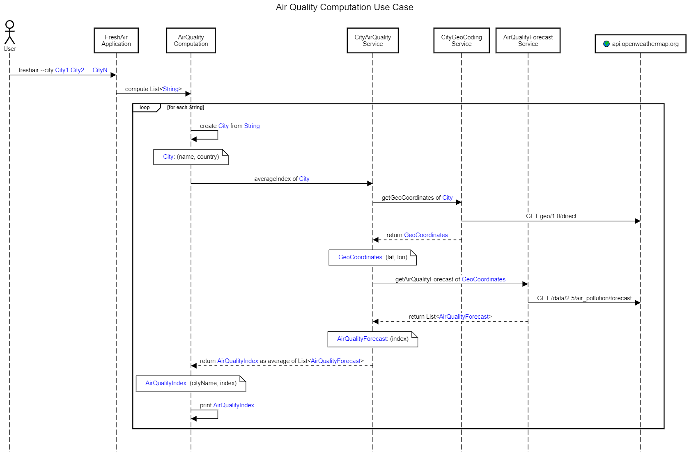
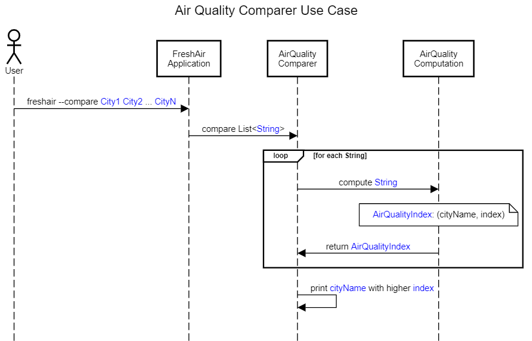

[](https://github.com/AdevintaSpain/wonderful-freshair-app/actions/workflows/gradle.yml)

# 🦄 Wonderful FreshAir Application

Sample to play with [Kotlin](https://kotlinlang.org/) & [Arrow](https://arrow-kt.io/)

Check our [discussions page](https://github.com/AdevintaSpain/wonderful-freshair-app/discussions) out 👀

## How it was made?

* Session #1 "Modelando Ausencia de Valor" [on youtube](https://youtu.be/q52oo2KOQYo) and [pull request changes](https://github.com/AdevintaSpain/wonderful-freshair-app/pull/1)
* Session #2 "Gestión Funcional de Errores" [on youtube](https://youtu.be/8RD_G6aY7Nk) and [pull request changes](https://github.com/AdevintaSpain/wonderful-freshair-app/pull/2)
* Session #3 "Gestión de Errores con Validated" [on youtube](https://youtu.be/989t4x2gMJQ) and [pull request changes](https://github.com/AdevintaSpain/wonderful-freshair-app/pull/6)
* Session #4 "Resumen Data Types" [on youtube](https://youtu.be/B5HKrSHYmjI) and [pull request changes](https://github.com/AdevintaSpain/wonderful-freshair-app/pull/9)


## Run

Get your OpenWeatherMap API key from [https://openweathermap.org/api](https://openweathermap.org/api)

* Linux/MacOS
```bash
export OWM_APIKEY=xxxx
./freshair --city Barcelona,ES Paris,FR London,UK
```

* Windows
```powershell
$Env:OWM_APIKEY="xxxx"
.\freshair.bat --city Barcelona,ES Paris,FR London,UK
```

## Use Cases



